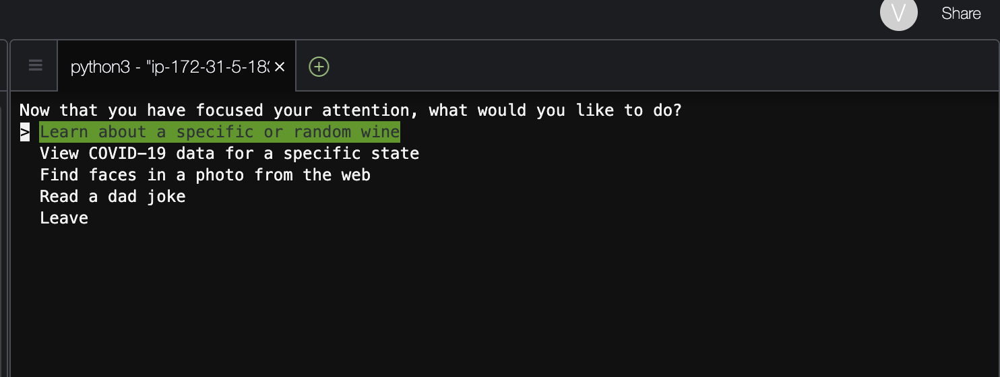
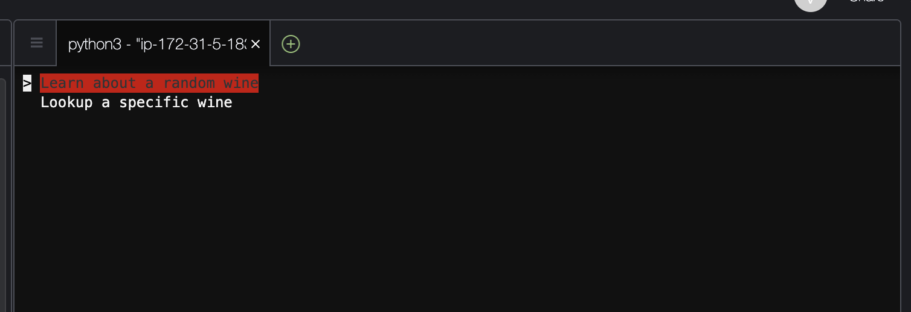
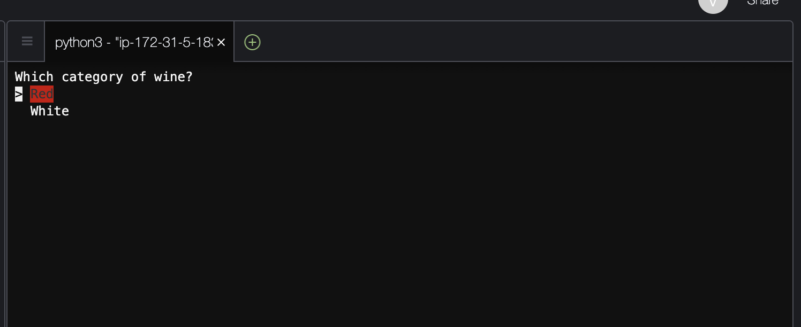
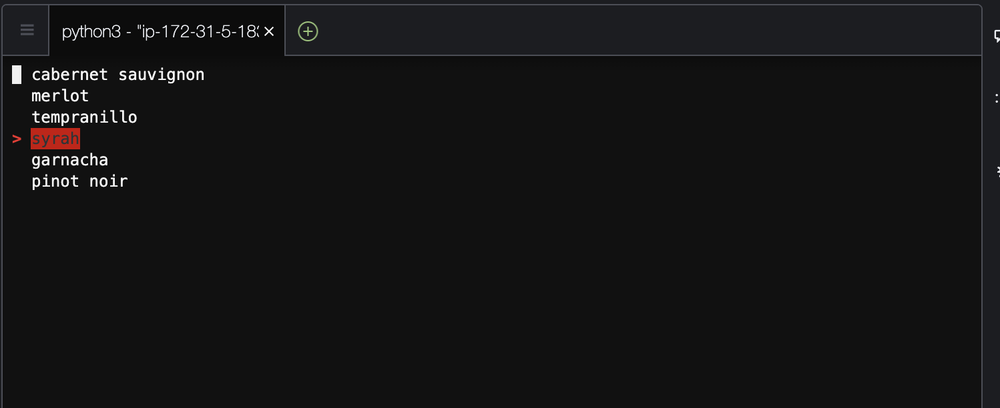
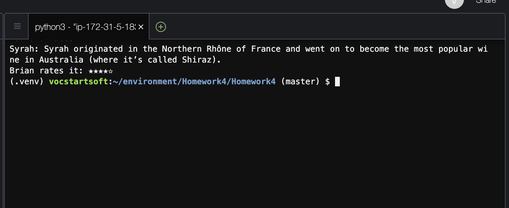
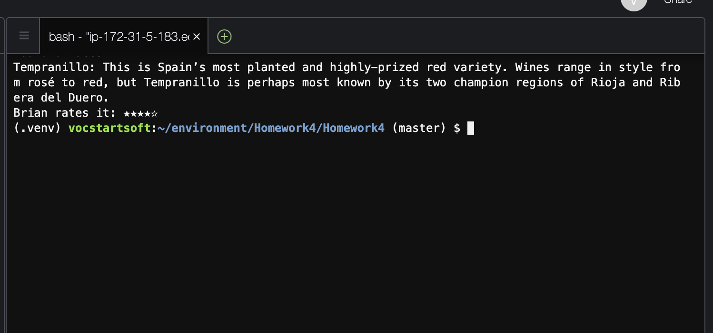
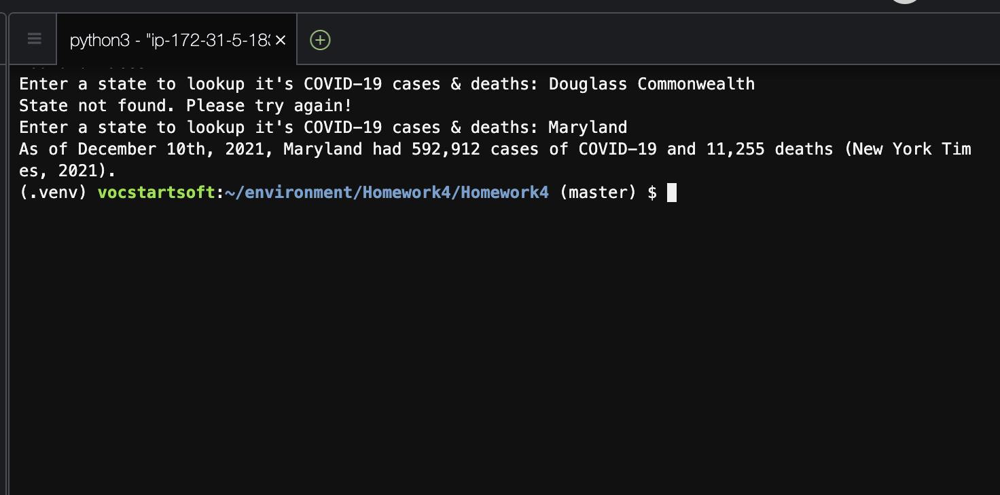
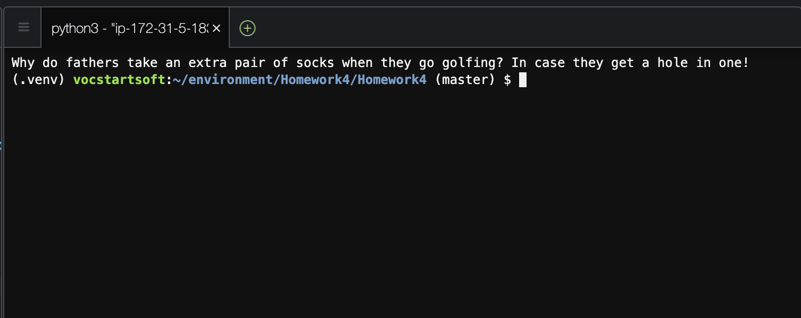
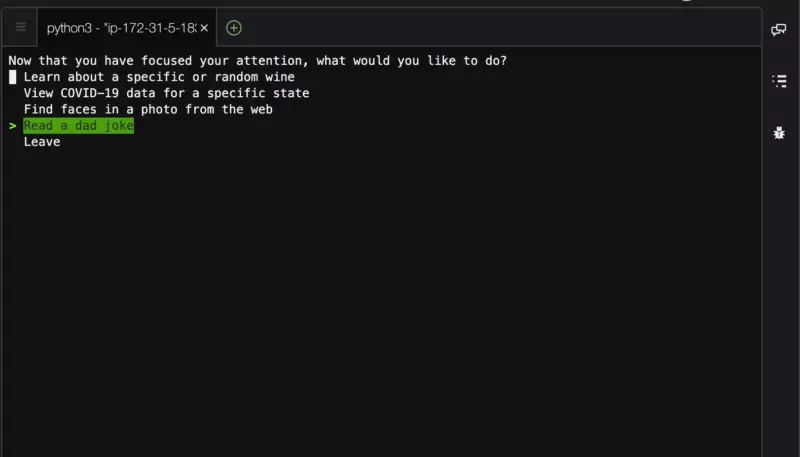

# Homework 4
## Brian Prost

Further exploration of AWS Services, specifically DynamoDB, S3 buckets, Serverless Computing with AWS Lambda, and using REST API with AWS.

Outside of the project constraints, I'm exploring Python features such as modularity and lambda functions.

If there are errors importing OpenCV, please try or verify that it has been installed as a system package instead of just a python package.

For instance, on CentOS, which is was what I used for development of this project, run:

`sudo yum install opencv opencv-devel opencv-python`

### Limitations
While this started as a very fun final project, the restrictions on AWS permissions from UMGC severly hindered the functionality of this project. See other projects for more fun stuff.

## Usage

### Initial Menu
Here is the first layer of the menu. Instead of typing in what you want to do, simply use the up and down buttons on your keyboard to select an option. Then press enter.

### Amazon Wine Services
The next thing we’re greeted with is two options: to learn about a specific wine or to choose a specific wine to learn about.

##### Specific Wine
The next screen asks if you want to learn about good wines (reds) or bad wines (whites). Choose wisely:

After selecting the color, select the specific wine you’d like to learn about.

Here we selected ‘Syrah.’ We’re then given a description of the grape and my rating, represented by stars.

##### Random Wine
If random wine is selected, then the user is brought right to the last step from before where the wine description and rating are printed:

#### About the implementation and integration with AWS
This service is achieved by loading a JSON file stored in S3 that is loaded locally, parsed, and selectively printed to the user.

### ”Hey Alexa, do I have COVID?”

If the option for COVID data is selected, then the next thing you’ll see a prompt to type in the state you’re looking for information about:

As you can tell, the application will properly handle any situations in which an invalid entry is entered. But when the correct one is entered, the corresponding data is displayed.

#### About the implementation and integration with AWS

This service uses an API call, AWS Lambda, and DynamoDB to achieve this solution. The state input is prompted and verified locally and then a Lambda function will access the data from a DynamoDB table, all triggered by an API call.

### Facebox
If the option to recognize faces present in a photo is selected, the user will see a prompt (as seen below) and can paste or type in a direct link to an image on the web. Then, using OpenCV, a rudimentary facial scan will take place to attempt to identify any faces in the photo. If it finds any, it will upload it to an S3 bucket and give the user a URL that they can visit to download and/or share the photo. An example:

As previously mentioned, the scan is very basic and has a low accuracy rate. This is of no concern because it’s not pertinent to the assignment, but I would love to improve this over the holiday season. Here’s the photo that was used in the example with the box that the program drew over it:

#### About the implementation and integration with AWS

This service uses S3 to save and access both the original photo and the edited one. The goal was to have this be a Lambda function, but using OpenCV with AWS Lambda proved difficult since one needs to install OpenCV not only as a Python package but also a system package. 

### Dad Joke

Last and certainly not least, the dad jokes. If the user selects this, the application prints out a dad joke that is saved in a database. No further action is required after selecting this option from the main menu.

#### About the implementation and integration with AWS

If the dad\_joke option is selected, an API call to a Lambda function is made. The Lambda function generates a random integer between 0 and the length of the rows in the DadJoke table. Then it uses the `boto3.get_item` function to get the joke from DynamoDB. It returns the joke as a string inside of the JSON response.

### Saying Goodbye

When leaving the app, I made a stupid little animation to say goodbye and thanks for all the fish. It’s of a guy throwing a table like, “Hey you, get out of here! Leave!” 

